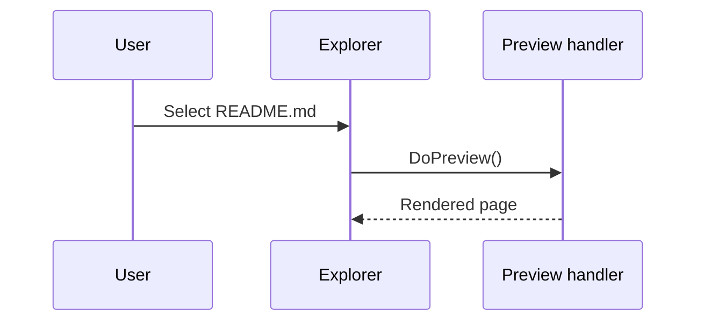

# Diagrams, math and images

```mermaid
flowchart LR
    A[Agent writes plan.md] --> B{Preview pane}
    B -->|Select| C[Rendered page]
    B -->|Double-click| D[Editor]
```

```mermaid
sequenceDiagram
    participant U as User
    participant E as Explorer
    participant H as Preview handler
    U->>E: Select README.md
    E->>H: DoPreview()
    H-->>E: Rendered page
```

Inline math: the loss is $L = -\sum_i y_i \log \hat{y}_i$ and the area is $\pi r^2$.

$$
\int_0^\infty e^{-x^2}\,dx = \frac{\sqrt{\pi}}{2}
$$

